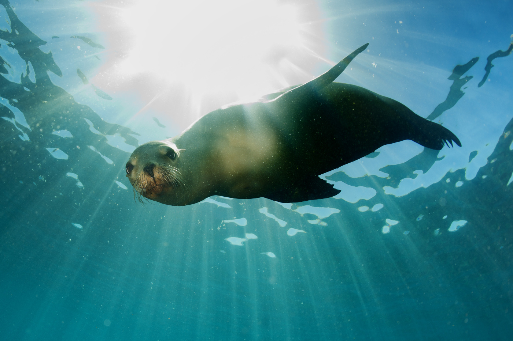

# ANNOUNCEMENT

The [Otago eDNA Research Group](https://otagoedna.github.io/) at the [University of Otago](https://www.otago.ac.nz/) will be hosting a meeting to bring together researchers at all levels to discuss research on metabarcoding and environmental DNA. Invited speakers from across Australia and New Zealand will present their research. We will soon open the site to receive abstracts for anyone interested in sharing their research. As well, a course on new bioinformatic methods in metabarcoding will be taught on the last day. This event is scheduled for 25-28th of November, 2019.

**Objective of Meeting**

The aim of the meeting is to catch up on aspects of environmental DNA, focusing on metabarcoding and metagenomic methods. We hope this will be a good opportunity for students from New Zealand and Australia to catch up on the latest developments, meet with leaders in the field, and also to present their own research. We are currently planning eight sessions of talks spread over two days, with each led by an experienced researcher. 

## Confirmed Speakers

* Dianne Gleeson, University of Canberra, Canberra, Australia

* Alicia Grealy, Australian National University, Canberra, Australia

* [Susie Wood, Cawthron Institute, Nelson, New Zealand](https://www.cawthron.org.nz/people/2-susie-wood/)

* Anastasija Zaiko, Cawthron Institute, Nelson, New Zealand

## Preliminary Schedule 

A symposium will be held on the 26th and 27th of November, covering a wide range of topics. On the 28th an all-day course will be given on bioinformatic methods for metabarcoding data. The 25th of November will be an optional day for students and researchers that need to learn basic bioinformatic tools (command line and R) that will be needed for the Metabarcoding course. 

Day | Title |
----|-----|
25 November | Intro to Bioinformatic Tools for Metabarcoding |
26 November | Environmental DNA Symposium, Day 1 |
27 November | Environmental DNA Symposium, Day 2 |
28 November | Bioinformatic Methods in Metabarcoding Course |

**More details will be coming soon!**
